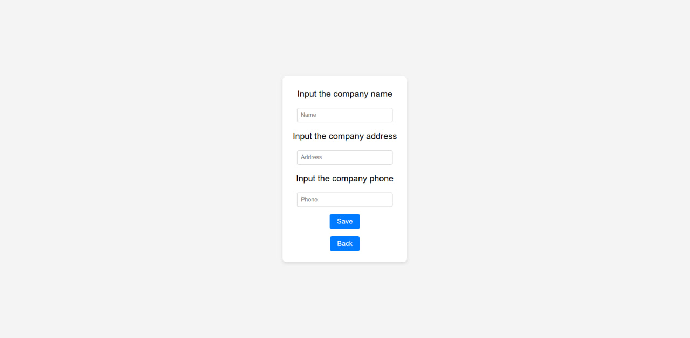
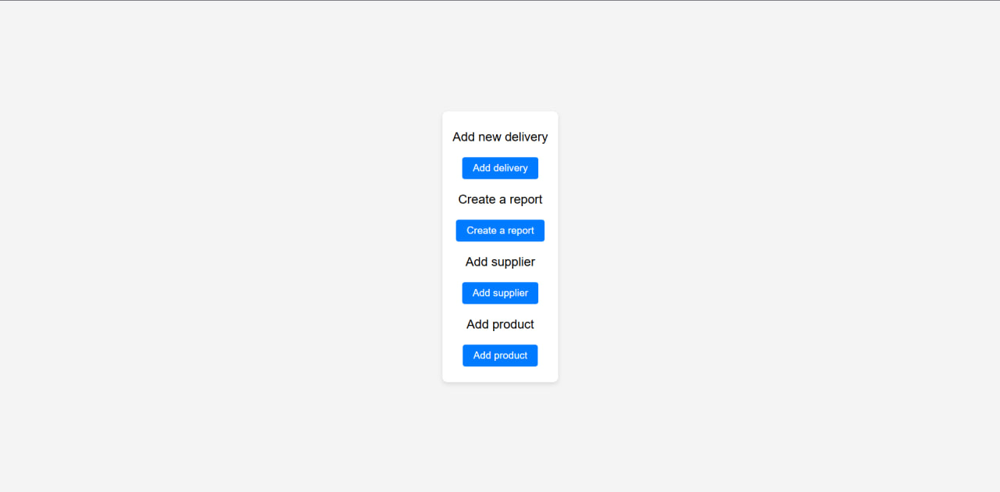

# 🎮 FruitsSupply | Delivery management app 

**Supplier, product, and delivery management app**  

   

## 🌟 About the Project  

A full-fledged web implementation of :   
- A small application developed as part of a test task for Severstal
- Application for delivery tracking
- Delivery ыummary кeporting фpplication 

### 🔥 Core Functionality  
| Feature | Description |  
|---------|------------|  
| 🚀 Add supplier | Add new suppliers to the centralized database (only for admin) |  
| 🍒 Add products of supplier | Add new products to the centralized database (only for admin) |  
| 📦 Add delivery | Add new deliverys to the centralized database |  
| 🏆 Create report | Generation of a report summarizing the weight and prices of all products delivered during a selected time period |   

## ⚙️ Tech Stack  

**Frontend:**  
  
  
  

**Backend:**  
  
  
  

**Infrastructure:**  
  

## 🎥 Video Demo  

You can watch the demo by clicking on the image below:  

