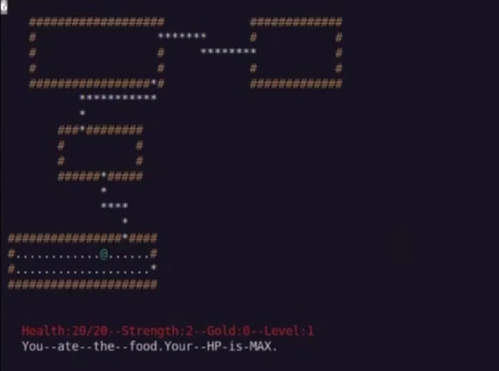
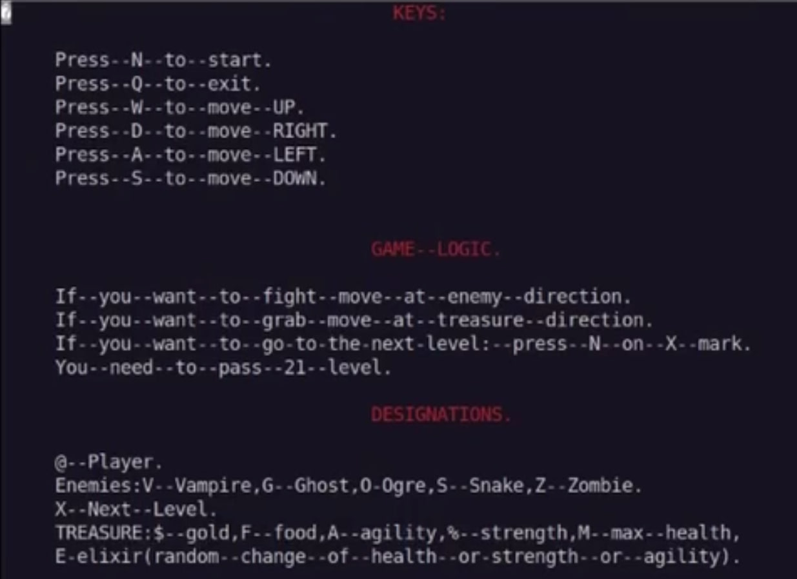

# 🎮 Rogue1980

**Rogue (1980) is a classic computer game in the roguelike genre that pioneered the entire genre. It was developed by Michael Toy, Glenn Wichman, and Ken Arnold and released in 1980 for UNIX systems.**  

 

## 🌟 About the Project  

A full-fledged web implementation of the legendary Rogue1980 game:  
- Educational project for [School 21](https://21-school.ru/)  
- Implementation of the cult classic game  
- Jcurses implementation for enhanced visual presentation

## 🚀 Key Features  

### 🔥 Core Functionality  
| Feature | Description |  
|---------|------------|  
| 👾 Fight enemies | Fight varied foes, each possessing distinct attributes, attack types, and movement mechanics |  
| 💎 Hunt treasure | Collect special treasures - they directly influence your endgame results |  
| 🏃 Conquer dungeons | Explore dungeons that are randomly generated |  
| 🔨 Upgrade weapon | Upgrade your weapons to defeat enemies more easily |
| 🍺 Look for boosts | Hunt for boosters that will bring unexpected twists to your game |
| 🏆 Leaderboard | Compete for a spot on the leaderboard |  

### ✨ Additional Features  
- Save system – resume your game without losing progress (automatic saving) 

## ⚙️ Tech Stack  

**Frontend:**  

**Backend:**  

 
**Infrastructure:**  
 

## 🎥 Video Demo  

You can watch the demo by clicking on the image below:  

